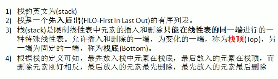
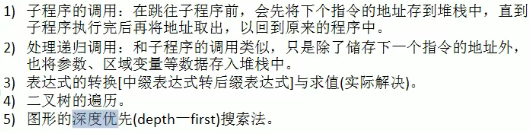
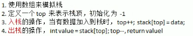
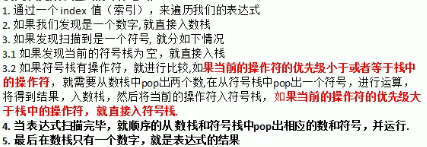
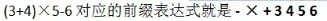
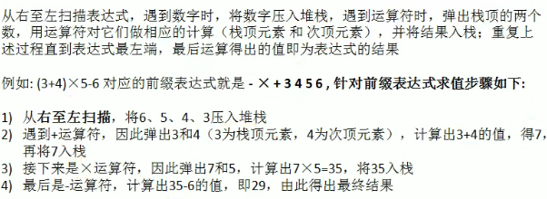
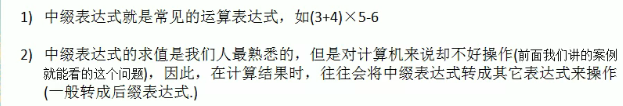
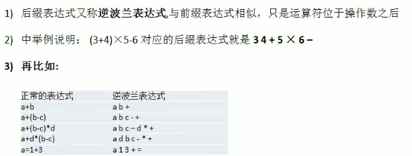
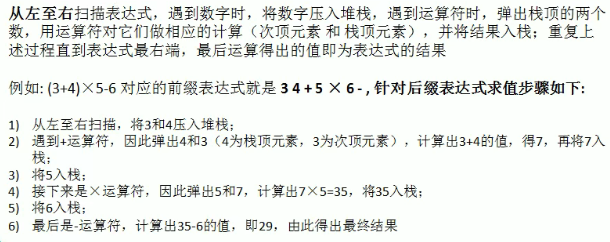

# 栈

## 1.概述

- 介绍

  

- 应用场景

  


## 2.代码实现

- 思路分析：

  

  

- ```java
  public class ArrayStackDemo {
      public static void main(String[] args){
          ArrayStack arrayStack = new ArrayStack(4);
          String key = "";
          boolean loop = true;
          Scanner scanner = new Scanner(System.in);
          while(loop){
              System.out.println("show: 显示栈");
              System.out.println("exit");
              System.out.println("push");
              System.out.println("pop");
              key = scanner.next();
              switch (key){
                  case "show":
                      arrayStack.list();
                      break;
                  case "push":
                      int value = scanner.nextInt();
                      arrayStack.push(value);
                      break;
                  case "pop":
                      try{
                          int res = arrayStack.pop();
                          System.out.println(res);
                      }catch (Exception e){
                          System.out.println(e.getMessage());
                      }
                  case "exit":
                     scanner.close();
                     loop = false;
                     break;
                  default:
                      break;
              }
          }
      }
  }
  class ArrayStack{
      private int maxSize;
      private int[] stack;
      private int top = -1;
      public ArrayStack(int maxSize){
          this.maxSize = maxSize;
          stack = new int[this.maxSize];
      }
      //栈满
      public boolean isFull(){
          return top == maxSize - 1;
      }
      public boolean isEmpty(){
          return top == -1;
      }
      public void push(int value){
          if(isFull()){
              System.out.println("full");
              return;
          }
          top++;
          stack[top] = value;
      }
      public int pop(){
          if(isEmpty()){
              throw new RuntimeException("empty");
          }
          int value = stack[top];
          top--;
          return value;
      }
      public void list(){
          if(isEmpty()){
              System.out.println("empty");
              return;
          }
          for(int i = top; i >= 0; i--){
              System.out.println(stack[i]);
          }
      }
  }
  ```

## 2.栈实现综合计算器

- 思路分析

  

- 代码实现：

  ```java
  public class Calculator {
      public static void main(String[] args){
          String expression = "30+2*6-2";
          ArrayStack2 numStack = new ArrayStack2(10);
          ArrayStack2 operStack = new ArrayStack2(10);
          int index = 0;
          int num1 = 0;
          int num2 = 0;
          int oper = 0;
          int res = 0;
          char ch = ' ';
          String keepNum = "";
          while(true){
              ch = expression.substring(index, index + 1).charAt(0);
              if(operStack.isOper(ch)){
                  if(operStack.isEmpty()){
                      operStack.push(ch);
                  }else{
                      if(operStack.priority(ch) <= operStack.priority(operStack.peek())){
                          num1 = numStack.pop();
                          num2 = numStack.pop();
                          oper = operStack.pop();
                          res = numStack.cal(num1, num2, oper);
                          numStack.push(res);
                          operStack.push(ch);
                      }else {
                          operStack.push(ch);
                      }
                  }
              }else{
                  keepNum += ch;
                  if(index == expression.length()-1){
                      numStack.push(Integer.parseInt(keepNum));
                  }else{
                      if(operStack.isOper(expression.substring(index+1, index+2).charAt(0))){
                          numStack.push(Integer.parseInt(keepNum));
                          keepNum = "";
                      }
                  }
              }
              index++;
              if(index >= expression.length()){
                  break;
              }
          }
          while(true){
              if(operStack.isEmpty())
                  break;
              num1 = numStack.pop();
              num2 = numStack.pop();
              oper = operStack.pop();
              res = numStack.cal(num1, num2, oper);
              numStack.push(res);
          }
          System.out.println(numStack.pop());
      }
  }
  
  class ArrayStack2{
      private int maxSize;
      private int[] stack;
      private int top = -1;
      public ArrayStack2(int maxSize){
          this.maxSize = maxSize;
          stack = new int[this.maxSize];
      }
      //栈满
      public boolean isFull(){
          return top == maxSize - 1;
      }
      public boolean isEmpty(){
          return top == -1;
      }
      public void push(int value){
          if(isFull()){
              System.out.println("full");
              return;
          }
          top++;
          stack[top] = value;
      }
      public int pop(){
          if(isEmpty()){
              throw new RuntimeException("empty");
          }
          int value = stack[top];
          top--;
          return value;
      }
      public void list(){
          if(isEmpty()){
              System.out.println("empty");
              return;
          }
          for(int i = top; i >= 0; i--){
              System.out.println(stack[i]);
          }
      }
      //返回运算符优先级
      public int priority(int oper){
          if(oper == '*' || oper == '/'){
              return 1;
          }else if(oper == '+' || oper == '-'){
              return 0;
          }else{
              return -1;
          }
      }
      //判断是否为运算符
      public boolean isOper(char val){
          return val == '+' || val == '-' || val == '*' || val == '/';
      }
      public int peek(){
          return stack[top];
      }
      //计算方法
      public int cal(int num1, int num2, int oper){
          int res = 0;
          switch (oper){
              case '+':
                  res = num1 + num2;
                  break;
              case '-':
                  res = num2 - num1;
                  break;
              case '*':
                  res = num1 * num2;
                  break;
              case '/':
                  res = num1 / num2;
                  break;
              default:
                  break;
          }
          return res;
      }
  }
  ```

## 3.前缀、中缀、后缀表达式（逆波兰表达式）

#### 1.前缀表达式

- 又称波兰式，运算符位于操作数之前
- 举例：
- 


#### 2.中缀表达式

- 


#### 3.后缀表达式

- 
- 
- 

