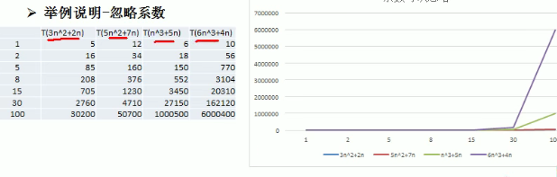

# 时间复杂度

- 衡量一个程序（算法）执行时间的两种方法

1. 事后统计的方法

2. 事前估算法

   

### 1.时间频度

- 一个算法花费的时间与算法中语句的执行次数成正比例，哪个算法中语句执行次数多，它花费时间就多。**一个算法中的语句执行次数称为语句频度或时间频度。**记为`T(n)`

- 

- 注意：

  - 忽略常数项

    

  - 忽略低次项

    

  - 忽略系数

    

### 2.时间复杂度

- 

- 

- 计算时间复杂度的方法

  - 用常数1代替运行时间中的所有加法常数
  - 修改后的运行次数函数中，只保留最高阶项
  - 去除最高阶项的系数

- 常见的时间复杂度

  

  - 常数阶O(1)

    无论代码执行了多少行，只要没有循环等复杂结构。

    

  - 对数阶O(log2n)

    在while循环里，每次都将i * 2，乘完之后，i就距离n越来越近了。也就是说，2的x次方等于n，x = log2n 

    若i = i * 3；则为O(long3n)

    

  - 线性阶O(n)

    

  - 线性对数阶O(nlogN)

    就是将复杂度为O(logn)的代码循环n遍

    

  - 平方阶O(n^2)

    如果把复杂度为O(n)的代码再嵌套循环一遍，则为O(n^2)

    如果把复杂度为O(n)的代码再嵌套循环m遍，则为O(n*m)

    

  - 立方阶O(n^3)

### 3.平均时间复杂度和最坏时间复杂度

- **平均时间复杂度**

  是指所有可能的输入实例均以等概率出现的情况下，该算法的运行时间

- **最坏时间复杂度**

  最坏情况下的时间复杂度

## 空间复杂度

- 该算法所耗费的存储空间

