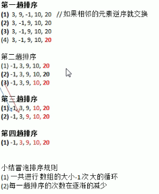
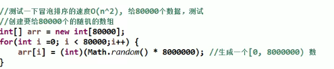
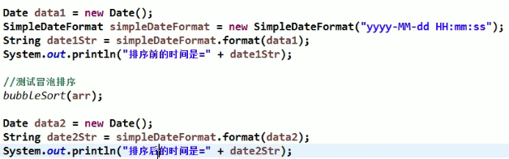

# 冒泡排序


## 1.基本介绍

### 基本思想

> Bubble Sorting: 通过对待排序序列从前向后（从下标较小的元素开始），依次比较相邻元素的值，若发现逆序则交换，使值较大的元素逐渐从前移向后部，就向水底的气泡一样逐渐向上冒。

## 2.冒泡排序图解



## 3.代码实现

```java
public class BubbleSort {
    public static void main(String[] args){
        int arr[] = {3, 9, -1, 10, -2};
        int temp = 0;
        for(int j = 0; j < arr.length - 1; j++){
            for(int i = 0; i < arr.length -1 - j; i++){
                if(arr[i] > arr[i + 1]){
                    temp = arr[i];
                    arr[i] = arr[i + 1];
                    arr[i + 1] = temp;
                }
            }
        }
        System.out.println(Arrays.toString(arr));
    }
}
```

- 时间复杂度O(n^2)


## 4.优化代码

```java
public class BubbleSort {
    public static void main(String[] args){
        int arr[] = {3, 9, -1, 10, -2};
        boolean flag = false;
        int temp = 0;
        for(int j = 0; j < arr.length - 1; j++){
            for(int i = 0; i < arr.length -1 - j; i++){
                if(arr[i] > arr[i + 1]){
                    flag = true;
                    temp = arr[i];
                    arr[i] = arr[i + 1];
                    arr[i + 1] = temp;
                }
            }
            if(flag == false){
                break;
            }else{
                flag = false;
            }
        }
        System.out.println(Arrays.toString(arr));
    }
}
```

## 5.测试冒泡排序的速度



