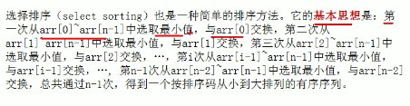
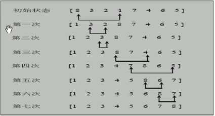
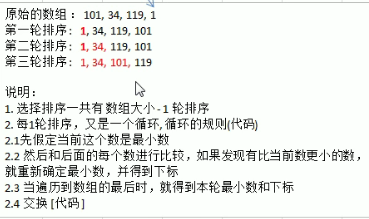

# 选择排序

## 1.基本思想

- 

- 思路分析图

  

  


## 2.代码实现

```java
public class SelectSort {
    public static void main(String[] args){
        int[] arr = {101, 34, 119, 1};
        selectSort(arr);
        System.out.println(Arrays.toString(arr));
    }
    public static void selectSort(int[] arr){
        int minIndex;
        int min;
        for(int i = 0; i < arr.length - 1; i++){
            min = arr[i];
            minIndex = i;
            for(int j = i + 1; j < arr.length; j++){
                if(min > arr[j]){
                    min = arr[j];
                    minIndex = j;
                }
            }
            if(minIndex != i){
                arr[minIndex] = arr[i];
                arr[i] = min;
                System.out.println(Arrays.toString(arr));
            }
        }
    }
}
```

时间复杂度O(n^2)

