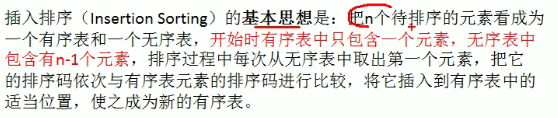
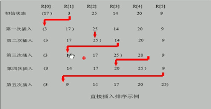

# 插入排序

%E6%8F%92%E5%85%A5%E6%8E%92%E5%BA%8F-16401757730031-16401757754512.gif?lastModify=1640175853)

## 1.基本介绍

### 基本思想

> 属于内部排序算法、是对于欲排序的元素以插入的方式寻找该元素的适当位置，以达到排序的目的



## 2.排序图解



## 3.代码实现

```java
import java.util.Arrays;

public class InsertSort {
    public static void main(String[] args){
        int[] arr = {101, 34, 119, 1, -1, 89};
        insertSort(arr);
        System.out.println(Arrays.toString(arr));
    }
    public static void insertSort(int[] arr){
        for(int i = 1; i < arr.length; i++){
            int insertVal = arr[i];
            int insertIndex = i -1;
            while(insertIndex >= 0 && insertVal <arr[insertIndex]){
                arr[insertIndex + 1] = arr[insertIndex];
                insertIndex--;
            }
            arr[insertIndex + 1] = insertVal;
        }
    }
}
```

- 时间复杂度O(n^2)

