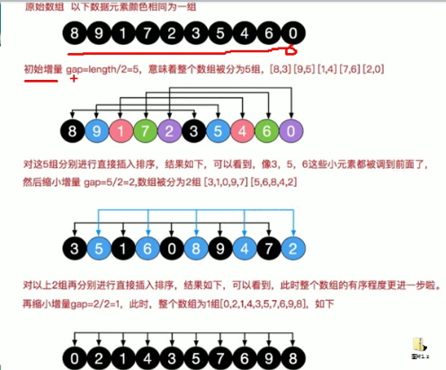
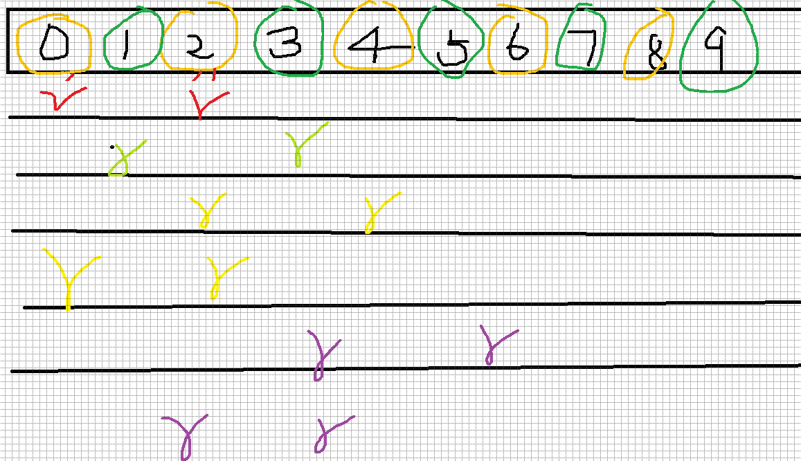
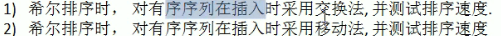

# 希尔排序


## 1.基本介绍

### 基本思想

> 它是简单插入排序经过改进之后的一种更高效的版本，也称为缩小增量排序

> 希尔排序是把记录按下标的一定增量分组，对每组使用直接插入排序算法排序；随着增量逐渐减少，每组包含的关键词越来越多，当增量减至1时，整个文件恰被分成一组，算法便终止

## 2.排序图解






## 3.代码实现



```java
//交换法
public class ShellSort {
    public static void main(String[] args){
        int[] arr = {101, 34, 119, 1};
        shellSort(arr);
        System.out.println(Arrays.toString(arr));
    }
    public static void shellSort(int arr[]){
        int temp = 0;
        for(int gap = arr.length / 2; gap > 0; gap /= 2){
            for(int i = gap; i < arr.length; i++){
                for(int j = i - gap; j >=0; j -= gap){
                    if(arr[j] > arr[j + gap]){
                        temp = arr[j];
                        arr[j] = arr[j + gap];
                        arr[j + gap] = temp;
                    }
                }
            }
        }
    }
}
```

- 时间复杂度O()


## 4.优化代码

```java
//移动法
    public static void shellSort2(int arr[]){
        int temp = 0;
        for(int gap = arr.length / 2; gap > 0; gap /= 2){
//从第gap个元素，逐个对其所在的组进行直接插入排序
            for(int i = gap; i < arr.length; i++){
                int j = i;
                int temp = arr[j];
                if(arr[j] < arr[j - gap]){
                    while(j - gap >= 0 && temp < arr[j - gap]){
                        //移动
                        arr[j] = arr[j - gap];
                        j -= gap;
                    }
                    arr[j] = temp;
                }
            }
        }
    }
```
