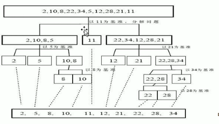

# 快速排序


## 1.基本介绍

>快速排序（Quicksort）是对冒泡排序的一种改进

1. 基本思想

   > 通过一趟排序将要排序的数据分割成独立的两部分，其中一部分的所有数据都比另外一部分的所有数据要小，然后再按此方法对这两部分数据分别进行快速排序，整个排序过程可以递归进行，以此达到整个数据变成有序

2. 图解

   

3. 代码实现

```java
public static void quickSort(int[] arr ,int left, int right){
    if (left >= right) return ;
    int l = left;
    int r = right;
    int mid = left;
    int temp = 0;
    while(l < r){
        while(arr[mid] <= arr[r] && l < r){
            r--;
        }
        if(arr[mid] > arr[r]){
            temp = arr[mid];
            arr[mid] = arr[r];
            arr[r] = temp;
        }
        while(arr[mid] >= arr[l] && l < r){
            l++;
        }
        if(arr[mid] < arr[l]){
            temp = arr[mid];
            arr[mid] = arr[l];
            arr[l] = temp;
        }
        min = left;
    }
    
    quickSort(arr, left, l -1);
    quickSort(arr, l + 1,right);
}
```