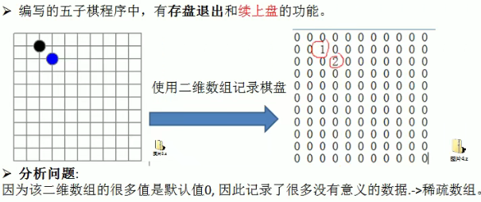
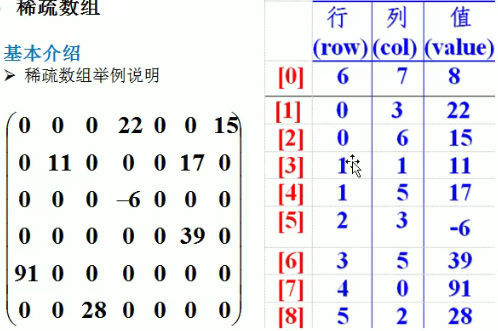
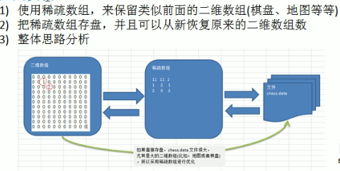
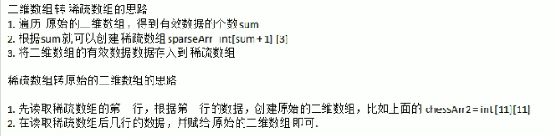
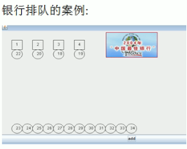
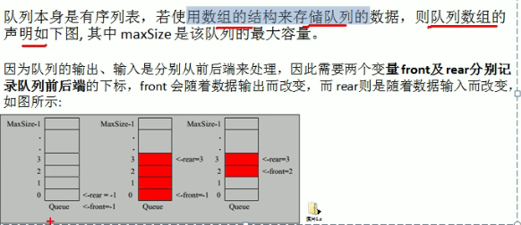
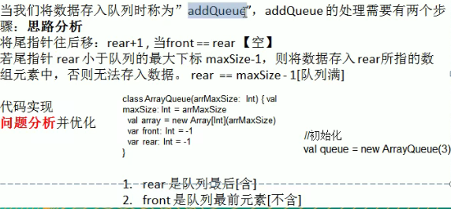
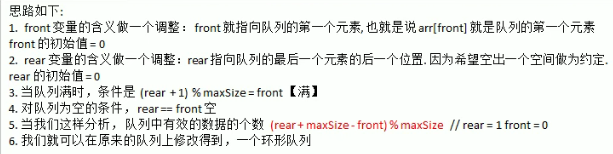

# 稀疏数组和队列

## 1.实际需求导入（SparseArray)

- 


## 2.稀疏数组

- **基本介绍**
  - 当一个数组中大部分元素为0，或者为同一个值的数组时，可以使用稀疏数组来保存该数组。
  - 处理方法：
    - 记录数组一共有几行几列，有多少个不同的值
    - 把具有不同值的元素的行列及值记录在一个小规模的数组中，从而缩小程序的规模
  - 


## 3.应用实例

- 
- 


## 4.代码实现

```java
//sparsearray
public class SparseArray{
    public static void main(String[] args){
    //创建一个原始的二维数组
    //0,1分别表示有没有棋子
        int chessArr1[][] = new int[11][11];
        chess1[1][2] = 1;
        chess1[2][3] = 2;
        //输出原始数据
        for(int data: row){
            System.out.println("%d\t",data);
        }
        System.out.println();
}
    //1.先遍历，得到非零数据个数
    int sum = 0;
    int count = 0;
    for(int i = 0; i < 11; i++){
        for(int j = 0; j < 11; j++){
            if(chessArr1[i][j] != 0){
                sum++;
            }
        }
    }
    System.out.println("sum="+sum);
    //2.创建对应的稀疏数组
    int sparseArr[][] = new int[sum+1][3];
    sparseArr[0][0] = 11;
    sparseArr[0][1] = 11;
    sparseArr[0][3] = sum;
    //遍历二维数组,将非0值存放到稀疏数组里  
    for(int i = 0; i < 11; i++){
        for(int j = 0; j < 11; j++){
            if(chessArr1[i][j] != 0){
                count++;
                sparseArr[count][0] = i;
                sparseArr[count][1] = j;
                sparseArr[count][2] = chessArr1[i][j];
            }
        }
    }
    //输出稀疏数组的形式
    System.out.println();
    for(int i = 0;i < sparseArr.length; i++){
        System.out.println("%d\t%d\t%d\t\n",sparsArr[i][0],sparsArr[i][1],sparsArr[i][2]);
    }
 
    //稀疏数组恢复原始的二维数组
    int chessArr2[][] = new int[sparse[0][0]][sparseArr[0][1]];
    for(int i = 1; i < sparseArr.length; i++){
        chessArr2[sparseArr[i][0]][sparseArr[i][1]] = sparseArr[i][2];
    }   
}


```

## 5.使用场景导入（queue）



## 6.队列

- **介绍**

  - 队列是一个有序列表，可以用数组或是链表来实现。
  - 遵循先入先出的原则。

- **数组模拟队列**

  - 

  - 

  - ```java
    public class ArrayQueueDemo{
        public static void main(String[] args){
            ArrayQueue arrayQueue = new ArrayQueue(3);
            char key = '';
            Scanner scanner = new Scanner(System.in);
            boolean loop = true;
            while(loop){
                System.out.println("s(show):显示队列");
                System.out.println("e(exit):退出程序");
                System.out.println("a(add):添加数据到队列");
                System.out.println("g(get):从队列取出数据");
                System.out.println("h(head):查看队列的头部");
                key = scanner.next().charAt(0);
                switch(key){
                    case 's':
                        arrayQueue.showQueue();
                        break;
                    case 'a':
                        System.out.println("输入一个数");
                        int value = scanner.nextInt();
                        arrayQueue.addQueue(value);
                        break;
                    case 'g':
                        try{
                            int res = arrayQueue.getQueue();
                            System.out.println(res);
                        }catch(Exception e){
                            System.out.println(e.getMessage());
                        }
                        break;
                    case 'h':
                        try{
                            int res = arrayQueue.headQueue();
                            System.out.println(res);
                        }catch(Exception e){
                            System.out.println(e.getMessage());
                        }
                        break;
                    case 'e':
                        Scanner.close();
                        loop = false;
                        break;
                    default:
                        break;
                }
            }
            System.out.println("程序结束");
        }
    }
    
    //使用数组模拟队列
    class ArrayQueue{
        private int maxSize;
        private int front;
        private int rear;
        private int[] arr;
        public ArrayQueue(int arrMaxSize){
            maxSize = arrMaxSize;
            arr = new int[maxSize];
            front = -1;//指向队列头部，头的前一个位置
            rear = -1;//指向队列尾部数据
        }
        public boolean isFull(){
            return rear == maxSize - 1;
        }
        public boolean isEmpty(){
            return rear == front;
        }
        public void addQueue(int n){
            if(isFull()){
                System.out.println("FULL");
                return;
            }
            rear++;
            arr[rear] = n;
        }
        public int getQueue(){
            if(isEmpty()){
                throw new RuntimeException("队列为空");
            }
            front++;
            return arr[front];
        }
        public void showQueue(){
            if(isEmpty()){
                System.out.println("队列为空");
            }
            for(int i = 0; i < arr.length; i++){
                System.out.println("arr[%d]=%d\n",i,arr[i]);
            }
        }
        public int headQueue(){
            if(isEmpty()){
                throw new RuntimeException("队列为空");
            }
            return arr[front + 1];
        }
    }
    ```

- **数组模拟环形队列**：

  - 

  - ```
    //数组模拟环形队列
    
    ```

  - 


