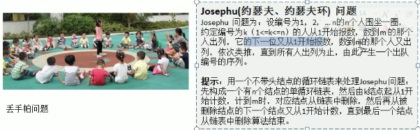

# 链表（Linked List)

## 1.介绍

- 

## 2.单链表代码实现

- ```java
  public class SingleLinkedListDemo{
      public static void main(String[] args){
          HeroNode heroNode = new HeroNode(1, "宋江", "及时雨");
          SingleLinkedList singleLinkedList = new SingleLinkedList();
          singleLinkedList.add(heroNode);
          singleLinkedList.list();
      }
  }
  class SingleLinkedList{
      private HeroNode head = new HeroNode(0,"" ,"");
      public void add(HeroNode heroNode){
          HeroNode temp = head;
          while(true){
              if(temp.next == null){
                  break;
              }
              temp = temp.next;
          }
          temp.next = heroNode;
      }
      public void addByOrder(HeroNode heroNode){
          HeroNode temp = head;
          boolean flag = false;
          while(true){
              if(temp.next == null){
                  break;
              }
              if(temp.next.no > heroNode.no){
                  break;
              }else if(temp.next.no == heroNode.no){
                  flag = true;
                  break;
              }
              temp = temp.next;
          }
          if(flag){
              System.out.println("已存在");
          }else{
              heroNode.next = temp.next;
              temp.next = heroNode;
          }
      }
      public void updata(HeroNode newHeroNode){
          if(head.next == null){
              System.out.println("null");
              return;
          }
          HeroNode temp = head.next;
          boolean flag = false;
          while(true){
              if(temp == null){
                  break;
              }
              if(temp.no == newHeroNode.no){
                  flag = true;
                  break;
              }
              temp = temp.next;
              if(flag){
                  temp.name = newHeroNode.name;
              }else{
                  System.out.println("null\n");
              }
          }
      }
      public void list(){
          if(head.next == null){
              System.out.println("null");
              return;
          }
          HeroNode temp = head.next;
          while(true){
              if(temp == null){
                  break;
              }
              System.out.println(temp);
              temp = temp.next;
          }
      }
      public  void del(int no){
          HeroNode temp = head;
          boolean flag = false;
          while(true){
              if(temp.next == null){
                  break;
              }
              if(temp.next.no == no){
                  flag = true;
                  break;
              }
              temp = temp.next;
          }
          if(flag){
              temp.next = temp.next.next;
          }else{
              System.out.printf("wu");
          }
      }
  }
  class HeroNode{
      public int no;
      public String name;
      public String nickname;
      public HeroNode next;
      public HeroNode(int hNo, String hName, String hNickname){
          this.no = hNo;
          this.name = hName;
          this.nickname = hNickname;
      }
  
      @Override
      public String toString() {
          return "HeroNode{" +
                  "no=" + no +
                  ", name='" + name + '\'' +
                  ", nickname='" + nickname + '\'' +
                  ", next=" + next +
                  '}';
      }
  }
  ```


## 3.单链表的面试题

- 

- **1）**

  ```java
  public static int getLength(HeroNode head){
      if(head.next == null){
          return 0;
      }
      int length = 0;
      HeroNode cur = head.next;
      while(cur != null){
          length++;
          cur = cur.next;
      }
      return length;
  }
  ```

- **2)**

  

  ```java
  public static HeroNode findLastIndexNode(HeroNode head, int index){
      if(head.next == null){
          return null;
      }
      int size = getLength(head);
      if(index <= 0 || index > size){
          retrun null;
      }
      HeroNode cur = head.next; 
      for(int i = 0; i < size - index; i++){
          cur = cur.next;
      }
      return cur;
  }
  ```

- **3)**

  ```java
  public static void reverseList(HeroNode head){
      if(head.next == null || head.next.next == null){
          return;
      }
      HeroNode cur = head.next;  //辅助指针，遍历原来的链表
      HeroNode next = null;  //指向当前节点[cur]的下一个节点
      HeroNode reverseHead = new HeroNode(0, "", "");
      while(cur != null){
          next = cur.next;
          cur.next = reverseHead.next;
          reverseHead.next = cur;
          cur = next;
      }
      head.next = reverseHead.next;
  }
  ```

- **4)**

  ```java
  public static void reversePrint(HeroNode head){
      if(head.next == null){
          return;
      }
      Stack<HeroNode> stack = new Stack<HeroNode>();
      HeroNode cur = head.next;
      while(cur != null){
          stack.push(cur);
          cur = cur.next;
      }
      while(stack.size() > 0){
          System.out.println(stack.pop());
      }
  }
  ```

## 4.双向链表应用实例

- 
- 

## 5.双向链表代码实现

```java
public class DoubleLinkedListDemo{
    public static void main(String[] args){
       HeroNode2 heroNode = new HeroNode2(1, "宋江", "及时雨");
       DoubleLinkedList doubleLinkedList = new DoubleLinkedList();
       doubleLinkedList.add(heroNode);
       doubleLinkedList.list(); 
    }
}
class DoubleLinkedList{
    private HeroNode2 head = new HeroNode2(0, "", "");
    public HeroNode getHead(){
        return head;
    }
    public void del(int no){
        if(head.next == null){
            System.out.println("链表为空，无法删除");
            return;
        }
        HeroNode2 temp = head.next;
        boolean flag = false;
        while(true){
            if(temp == null){
               break; 
            }
            if(temp.no == no){
                flag = true;
                break;
            }
            temp = temp.next;
        }
        if(flag){
            temp.pre.next = temp.next;
            if(temp.next != null){
                temp.next.pre = temp.pre;
            }
        }else{
            System.out.println("null");
        }
    }
    public void list(){
        if(head.next == null){
            System.out.println("null");
            return;
        }
        HeroNode2 temp = head.next;
        while(true){
            if(temp == null){
                break;
            }
            System.out.println(temp);
            temp = temp.next;
        }
    }    
    public void add(HeroNode2 heroNode){
        HeroNode2 temp = head;
        while(true){
            if(temp.next == null){
                break;
            }
            temp = temp.next;
        }
        temp.next = heroNode2;
        heroNode.pre = temp'
    }
    public void updata(HeroNode2 newHeroNode){
        if(head.next == null){
            System.out.println("null");
            return;
        }
        HeroNode2 temp = head.next;
        boolean flag = false;
        while(true){
            if(temp == null){
                break;
            }
            if(temp.no == newHeroNode.no){
                flag = true;
                break;
            }
            temp = temp.next;
            if(flag){
                temp.name = newHeroNode.name;
            }else{
                System.out.println("null\n");
            }
        }
    }
}
class HeroNode2{
    public int no;
    public String name;
    public String nickname;
    public HeroNode2 next;
    public HeroNode2 pre;
    public HeroNode(int hNo, String hName, String hNickname){
        this.no = hNo;
        this.name = hName;
        this.nickname = hNickname;
    }

    @Override
    public String toString() {
        return "HeroNode{" +
                "no=" + no +
                ", name='" + name + '\'' +
                ", nickname='" + nickname + '\'' +
                ", next=" + next +
                '}';
    }
}
```

 ## 6.单向环形链表

- 应用场景：

  

- 约瑟夫问题代码实现：

  ```java
  public Josepfu{
      public static void main(String[] args){
           CircleSingleLinkedList circleSingleLinkedList = new CircleSingleLinkedList;
          circleSingleLinkedList.add(5);
          circleSingleLinkedList.list();
          circleSingleLinkedList.countBoy(1, 2,)
      }
  }
  class CircleSingleLinkedList{
      private Boy first = new Boy(-1);
      public void addBoy(int nums){
          if(nums < 1){
              System.out.println("Wrong");
              return;
          }
          Boy curBoy = null;
          for(int i = 1; i < nums; i++){
              Boy boy = new Boy(i);
              if(i == 1){
                  first = boy;
                  first.setNext(first);
                  curBoy = first;
              }else{
                  curBoy.setNext(boy);
                  boy.setNext(first);
                  curBoy = boy;
              }
          }
      }
      public void list(){
          if(first == null){
              System.out.println("null");
          }
          Boy curBoy = first;
          while(true){
              System.out.println(cur.getNo());
              if(curBoy.getNext() == first){
                  break;
              }
              curBoy = curBoy.next;
          }
      }
      public void countBoy(int startNo, int countNum, int nums){
          if(first == null || starNo < 1 || startNo > nums){
              System.out.println("wrong");
              return;
          }
          Boy helper = first;
          while(true){
              if(helper.getNext() == first){
                  break;
              }
              helper = helper.getNext();
          }
          for(int j = 0; j < Startno - 1; j++){
              first = first.getNext();
              helper = helper.getNext();
          }
          while(true){
              if(helper == first){
                  break;
              }
              for(int j = 0; j < countNum - 1; j++){
                  first = first.getNext();
                  helper = helper.getNext();
              }
              System.out.println(first.getNo());
              first = first.getNext();
              helper.setNext(first);
          }
      }
  }
  class Boy{
      private int no;
      private Boy next;
      public Boy(int no){
          this.no = no;
      }
      public int getNo(){
          return no;
      }
      public void setNo(int no){
          this.no = no;
      }
      public Boy getNext(){
          return next;
      }
      public void SetNext(Boy next){
          this.next = next;
      }
  }
  ```
