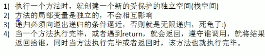

# 递归

- 递归就是方法自己调用自己，每次调用时传入不同的变量
- 程序每执行到一个方法时，就会开辟一个独立的空间栈


- 可用于解决什么问题

  - 各种数学问题：8皇后问题、汉诺塔、阶乘问题、迷宫问题、球和篮子问题
  - 各种算法也会用到递归，如快排，归并排序、二分查找、分治算法等
  - 将用栈解决的问题->递归代码比较简洁

- 规则：

  

- 迷宫问题：

  ```java
  public class MiGong {
      public static void main(String[] args){
          int[][] map = new int[8][7];
          for(int i = 0; i < 7;i++){
              map[0][i] = 1;
              map[7][i] = 1;
          }
          for(int i = 0; i < 8; i++){
              map[i][0] = 1;
              map[i][6] = 1;
          }
          map[3][1] = 1;
          map[3][2] = 1;
          for(int i = 0; i < 8; i++){
              for(int j = 0; j < 7; j++){
                  System.out.print(map[i][j]+" ");
              }
              System.out.println();
          }
          System.out.println("^^^^^^^^^^^^^^^");
          setWay(map, 1, 1);
          for(int i = 0; i < 8; i++){
              for(int j = 0; j < 7; j++){
                  System.out.print(map[i][j]+" ");
              }
              System.out.println();
          }
      }
      public static boolean setWay(int[][] map, int i, int j){
         //定策略：下、右、上、左，若该点走不通再回溯
          if(map[6][5] == 2){
              return true;
          }else{
              if(map[i][j] == 0){
                  map[i][j] = 2;
                  if(setWay(map, i + 1, j)){
                      return true;
                  }else if(setWay(map, i, j + 1)){
                      return true;
                  }else if(setWay(map, i - 1, j)){
                      return true;
                  }else if(setWay(map, i, j - 1)){
                      return true;
                  }else{
                      map[i][j] = 3;
                      return false;
                  }
              }else {
                  return false;
              }
          }
      }
  }
  ```

- 八皇后问题

  ```java
  public class Queue8 {
      int max = 8;
      int[] array = new int[max];
      static int count = 0;
      public static void main(String[] args){
          Queue8 queue8 = new Queue8();
          queue8.check(0);
          System.out.println("^^^^^^^^^^^^^^^^^^^^");
          System.out.println(count);
      }
      //编写一个方法放置第n个皇后
      private void check(int n){
          if(n == max){
              print();
              return;
          }
          for(int i = 0; i < max; i++){
              array[n] = i;
              if(judge(n)){
                  check(n + 1);
              }
          }
      }
      //查看当我们放置第n个皇后，就去检测该皇后是否和前面已经摆放的皇后冲突
      private boolean judge(int n){
          for(int i = 0; i < n; i++){
              if(array[i] == array[n] || Math.abs(n - i) == Math.abs(array[n] - array[i])){
                  return false;
              }
          }
          return true;
      }
      private void print(){
          count++;
          for(int i = 0; i < array.length; i++){
              System.out.print(array[i] + " ");
          }
          System.out.println();
      }
  }
  ```

  