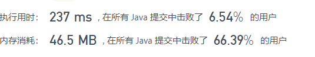
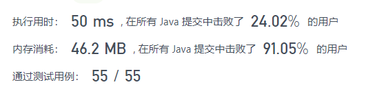
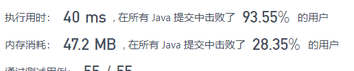

# 剑指offer 09. 用两个栈实现队列


### 题目地址：[用两个栈实现队列](https://leetcode-cn.com/problems/yong-liang-ge-zhan-shi-xian-dui-lie-lcof/)


### 题目描述：

>用两个栈实现一个队列。队列的声明如下，请实现它的两个函数 appendTail 和 deleteHead ，分别完成在队列尾部插入整数和在队列头部删除整数的功能。(若队列中没有元素，deleteHead 操作返回 -1 )


### 解答方法：

1. 

```java
class CQueue {
    Stack<Integer> stack1,stack2;
    public CQueue() {
        stack1 = new Stack<>();
        stack2 = new Stack<>();
    }

    public void appendTail(int value) {
            while(!stack1.isEmpty()){
                stack2.push(stack1.pop());
            }
            stack1.push(value);
            while(!stack2.isEmpty()){
                stack1.push(stack2.pop());
        }
    }

    public int deleteHead() {
        int temp;
        if(stack1.isEmpty()) temp = -1;
        else temp = stack1.pop();
        return temp;
    }
}

/**
 * Your CQueue object will be instantiated and called as such:
 * CQueue obj = new CQueue();
 * obj.appendTail(value);
 * int param_2 = obj.deleteHead();
 */
```

>
>
>
>
>1. 看了题解后发现都是在delete中进行顺序调换操作的。
>
>   而且这样stack2也能存储数据。
>
>   即用第一个栈添加元素，第二个栈删除元素，只在需要的时候进行遍历，而且也不用每次都遍历
>
>2. 将代码改成这种思路后：
>
>   
>
>3. 用链表进行存储，用时少了，内存消耗多了一点。
>
>   