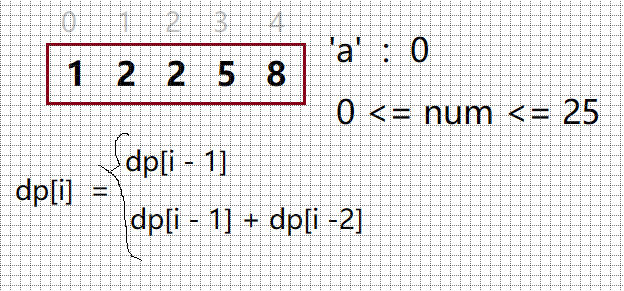

# 剑指offer 46. 把数字翻译成字符串

### 题目地址：[把数字翻译成字符串](https://leetcode-cn.com/problems/ba-shu-zi-fan-yi-cheng-zi-fu-chuan-lcof/)


### 题目描述：

>给定一个数字，我们按照如下规则把它翻译为字符串：0 翻译成 “a” ，1 翻译成 “b”，……，11 翻译成 “l”，……，25 翻译成 “z”。一个数字可能有多个翻译。请编程实现一个函数，用来计算一个数字有多少种不同的翻译方法
>


### 解答方法：

1. 



```java
class Solution {
    public int translateNum(int num) {
        String str = String.valueOf(num);
        int[] dp = new int[str.length() + 1];
        dp[0] = 1;
        dp[1] = 1;
        for (int i = 1; i < str.length(); i++) {
            if((str.charAt(i - 1) - 48) * 10 + (str.charAt(i) - 48) < 26 && (str.charAt(i - 1) - 48) * 10 + (str.charAt(i) - 48) >=10 ){
                dp[i + 1] = dp[i] + dp[i - 1];
            }else dp[i + 1] = dp[i];
        }
        return dp[str.length()];
    }
}
```

> *数组是最常用的数据结构之一，现在我们对数组的下标进行特殊处理，使每一次操作**仅保留若干有用信息**，新的元素不断循环刷新，看上去数组的空间被滚动地利用，此模型我们称其为**滚动数组***
>
> 优化思路
>
> 1. 不用dp数组，用两个变量保存有效数据
> 2. 求余得到每一位的值，省去String 所占的空间
>
> ```java
> class Solution {
>     public int translateNum(int num) {
>         int a = 1, b = 1, c, temp = num % 10,tmp;
>         while(num != 0){
>             num = num / 10;
>             tmp = num % 10;
>             if(tmp*10 + temp >= 10 && tmp*10 + temp < 26){
>                 c = a + b;
>                 b = a;
>                 a = c;
>             }else{
>                 c = a;
>                 b = a;
>                 a = c;
>             }
>             temp = tmp;
>         }
>         return a;
>     }
> }
> ```
>
> 
>
> 