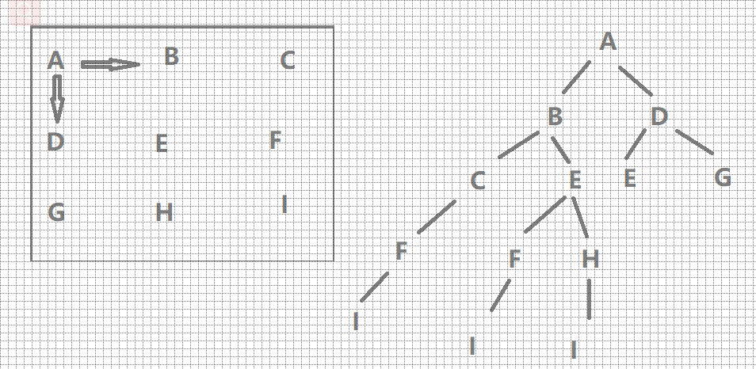

# 剑指offer 47. 礼物的最大价值

### 题目地址：[礼物的最大价值](https://leetcode-cn.com/problems/li-wu-de-zui-da-jie-zhi-lcof/)


### 题目描述：

>在一个 m*n 的棋盘的每一格都放有一个礼物，每个礼物都有一定的价值（价值大于 0）。你可以从棋盘的左上角开始拿格子里的礼物，并每次向右或者向下移动一格、直到到达棋盘的右下角。给定一个棋盘及其上面的礼物的价值，请计算你最多能拿到多少价值的礼物？
>


### 解答方法：

1. 



```java
class Solution {
    public int maxValue(int[][] grid) {
        int[][] dp = new int[grid.length+1][grid[0].length+1];
        dp[0][0] = grid[0][0];
        for (int i = 1; i <= grid.length; i++) {
            for(int j = 1;j <= grid[0].length; j++){
                dp[i][j] = Math.max(dp[i][j - 1],dp[i - 1][j])+grid[i -1][j -1];
            }
        }
        return dp[grid.length][grid[0].length];
    }
}
```