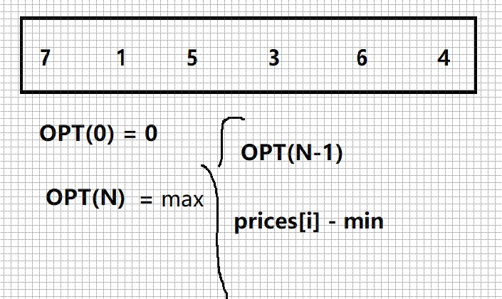

# 剑指offer 63. 股票的最大利润

### 题目地址：[股票的最大利润](https://leetcode-cn.com/problems/gu-piao-de-zui-da-li-run-lcof/)


### 题目描述：

>假设把某股票的价格按照时间先后顺序存储在数组中，请问买卖该股票一次可能获得的最大利润是多少？


### 解答方法：

1. 



```java
class Solution {
    public int maxProfit(int[] prices) {
        if(prices.length == 0) return 0;
        int min = prices[0];
        int profit = 0;
        for (int i = 1; i < prices.length; i++) {
            if(prices[i] < min) min = prices[i];
            profit = Math.max(profit,prices[i] - min);
        }
        return profit;
    }
}
```