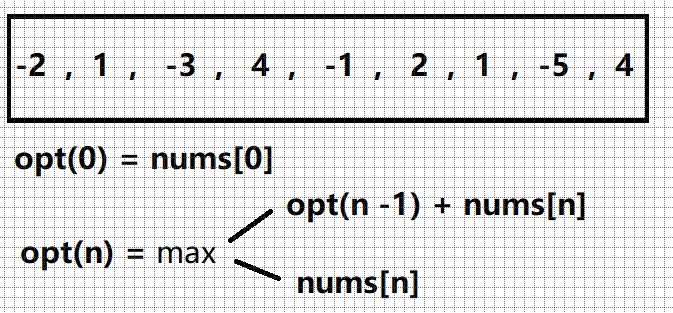

# 剑指offer 42. 连续子数组的最大和

### 题目地址：[连续子数组的最大和](https://leetcode-cn.com/problems/lian-xu-zi-shu-zu-de-zui-da-he-lcof/)


### 题目描述：

>输入一个整型数组，数组中的一个或连续多个整数组成一个子数组。求所有子数组的和的最大值。
>
>要求时间复杂度为O(n)。


### 解答方法：

1. 



```java
class Solution {
    public int maxSubArray(int[] nums) {
        int max = nums[0];
        int[] dp = new int[nums.length];
        dp[0] = max;
        for(int i = 1; i < nums.length; i++){
            max = Math.max(max + nums[i] , nums[i]);
            dp[i] = Math.max(dp[i - 1],max);
        }
        return dp[nums.length - 1];
    }
}
```