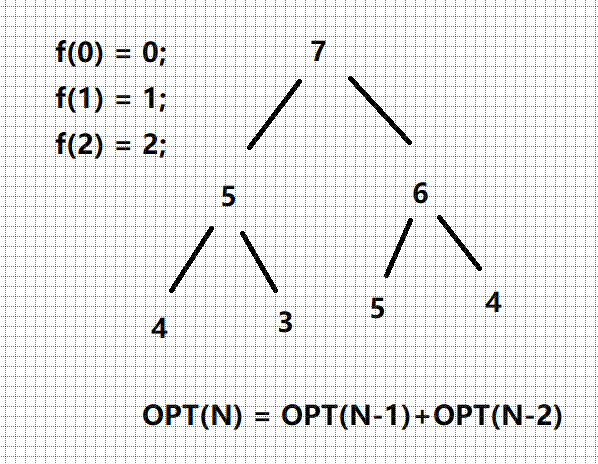

# 剑指offer 10 - II. 青蛙跳台阶问题

### 题目地址：[青蛙跳台阶问题](https://leetcode-cn.com/problems/qing-wa-tiao-tai-jie-wen-ti-lcof/)


### 题目描述：

>一只青蛙一次可以跳上1级台阶，也可以跳上2级台阶。求该青蛙跳上一个 n 级的台阶总共有多少种跳法。
>
>答案需要取模 1e9+7（1000000007），如计算初始结果为：1000000008，请返回 1
>


### 解答方法：

1. 



```java
class Solution {
    public int numWays(int n) {
        int num1 = 1, num2 = 1;
        int sum = 0;
        if(n == 0) return 1;
        else if(n == 1) return 1;
        else if(n >= 2){
            for(int i = 0;i < n;i++){
                sum = (num1 + num2) % 1000000007;
                num1 = num2;
                num2 = sum; 
            }
        }
        return num1;
    }
}
```