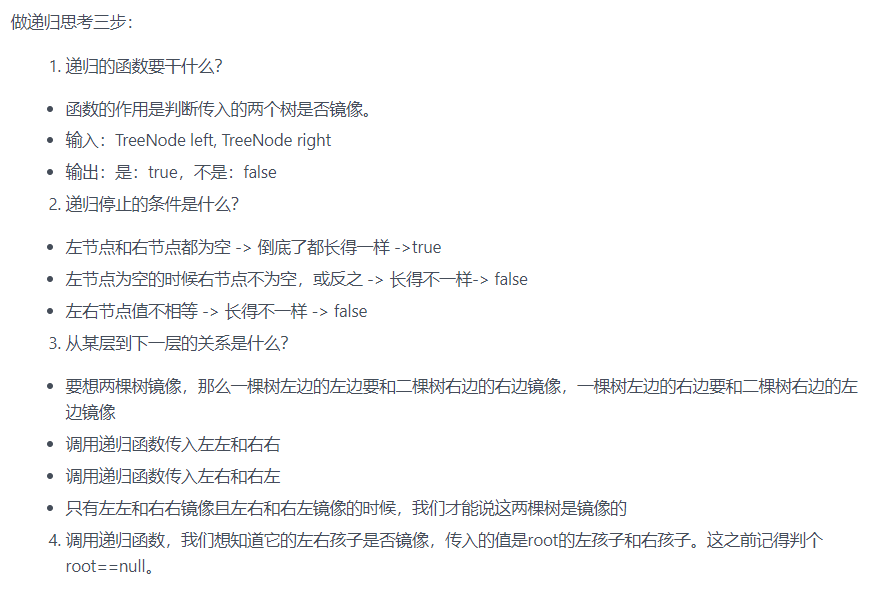

# 剑指offer 28. 对称的二叉树


### 题目地址：[对称的二叉树](https://leetcode-cn.com/problems/dui-cheng-de-er-cha-shu-lcof/)


### 题目描述：

>请完成一个函数，输入一个二叉树，该函数输出它的镜像。


### 解答方法：

1. 

- 用了List<List<Integer>>，再把每一层都对比看看对不对称，还要判断，把空结点也加入到list中。。。。

```java
class Solution {
    public boolean isSymmetric(TreeNode root) {
        if(root == null) return true;
        List<List<Integer>> list = new LinkedList<>();
        Queue<TreeNode> queue = new LinkedList<>();
        queue.add(root);
        while(!queue.isEmpty()){
            TreeNode node;
            List<Integer> list1 = new LinkedList<>();
            for (int i = queue.size(); i > 0; i--) {
                node = queue.poll();
                list1.add(node.val);
                if(node.val == Integer.MAX_VALUE)continue;
                if(node.left != null) queue.add(node.left);
                else queue.add(new TreeNode(Integer.MAX_VALUE));
                if(node.right != null) queue.add(node.right);
                else queue.add(new TreeNode(Integer.MAX_VALUE));
            }
            list.add(list1);
        }
        for(int i = 0; i < list.size() ; i++){
            for(int j = 0 , k = list.get(i).size() - 1; j <= k; j++,k--){
                if(!list.get(i).get(j).equals(list.get(i).get(k)))return false;
            }
        }
        return true;
    }
}
```

> 思路二：递归
>
> - 递归，条件是：
> - TRUE:左右节点都空
> - FALSE : 一个结点空，另一个还有 ；左右结点值不相等
> - 判断：左树的左孩子，要和右数的右孩子相等
>
> - 
>
> ```java
> class Solution {
>     public boolean isSymmetric(TreeNode root) {
>         if(root == null) return true;
>         return check(root.left,root.right);
>     }
>     public boolean check(TreeNode left,TreeNode right){
>         if(left == null && right == null) return true;
>         if(left == null || right == null || left.val != right.val)return false;
>         return check(left.left,right.right) && check(left.right,right.left);
>     }
> }
> ```