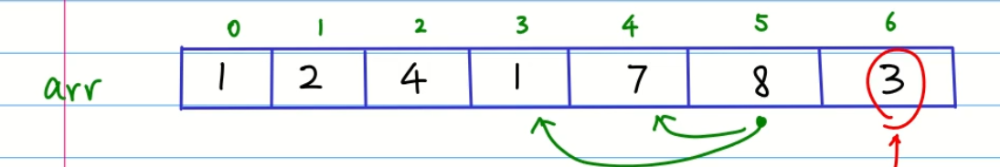
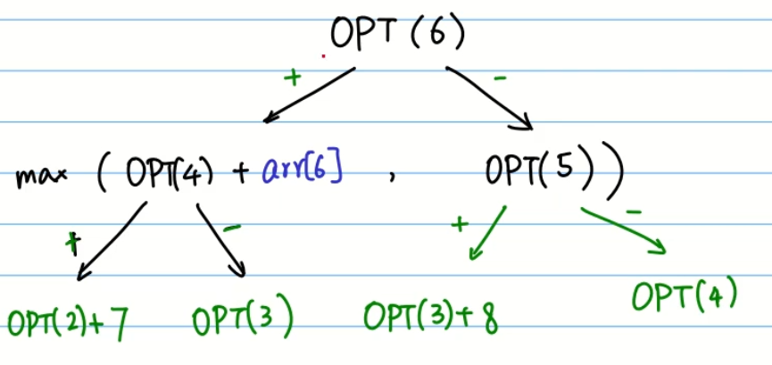
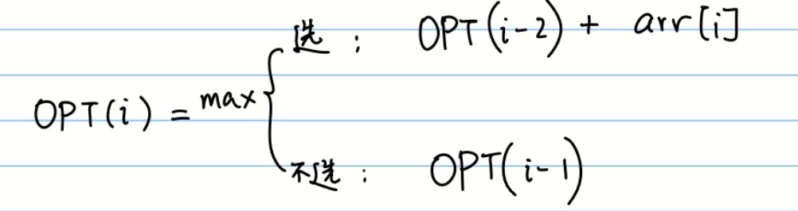
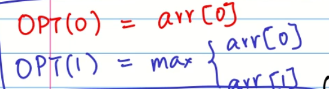
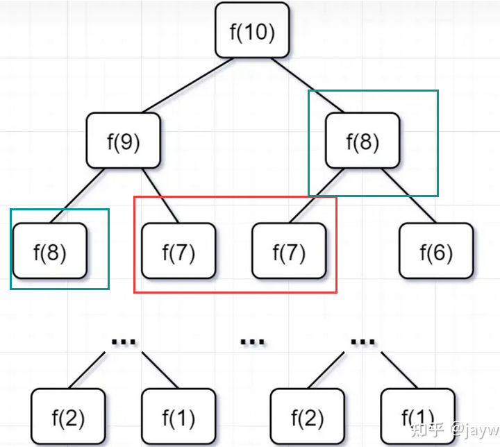

# 剑指offer 10 - I. 斐波那契数列


### 题目地址：[斐波那契数列](https://leetcode-cn.com/problems/fei-bo-na-qi-shu-lie-lcof/)


### 题目描述：

>写一个函数，输入 n ，求斐波那契（Fibonacci）数列的第 n 项（即 F(N)）。斐波那契数列的定义如下：
>
>F(0) = 0,   F(1) = 1
>F(N) = F(N - 1) + F(N - 2), 其中 N > 1.
>斐波那契数列由 0 和 1 开始，之后的斐波那契数就是由之前的两数相加而得出。
>
>答案需要取模 1e9+7（1000000007），如计算初始结果为：1000000008，请返回 1
>


### 解答方法：


**动态规划**

1. 动态规划常常适用于**有重叠子问题**和**最优子结构性质**的问题

2. 适用情况

   - 如果问题的最优解所包含的子问题的解也是最优的，我们就称该问题具有最优子结构性质（即满足最优化原理）。`最优子结构性质`为动态规划算法解决问题提供了重要线索。
   - `无后效性`即子问题的解一旦确定，就不再改变，不受在这之后、包含它的更大的问题的求解决策影响。
   - `子问题重叠性质`子问题重叠性质是指在用递归算法自顶向下对问题进行求解时，每次产生的子问题并不总是新问题，有些子问题会被重复计算多次。动态规划算法正是利用了这种子问题的重叠性质，对每一个子问题只计算一次，然后将其计算结果保存在一个表格中，当再次需要计算已经计算过的子问题时，只是在表格中简单地查看一下结果，从而获得较高的效率。

2. 步骤：
   - 穷举分析
   - 确定边界
   - 找出规律，确定最优子结构
   - 写出状态转移方程
   
4. 总结

   

   - 从后向前画树形图，找到状态表示（最优子结构）

     

   - 归纳状态迁移方程

     

   - 找出边界情况

     


1. 

- 使用递归方法，会有大量的重复计算，而导致超时

  

- 优化方法

  1. 记忆化

     > - 在递归法的基础上，新建一个长度为 nn 的数组，用于在递归时存储 f(0)至 f(n) 的数字值，重复遇到某数字则直接从数组取用，避免了重复的递归计算。
     > - **缺点：** 记忆化存储需要使用 O(N) 的额外空间。

```java
class Solution {
    public int fib(int n) {
        if(n < 2) return n;
        int num1  = 0, num2 = 1;
        int sum = 1;
        for(int i = 2; i <= n; i++){
            sum = (num1 + num2) % 1000000007;
            num1 = num2;
            num2 = sum;
        }
        return num2;
    }
}
```
