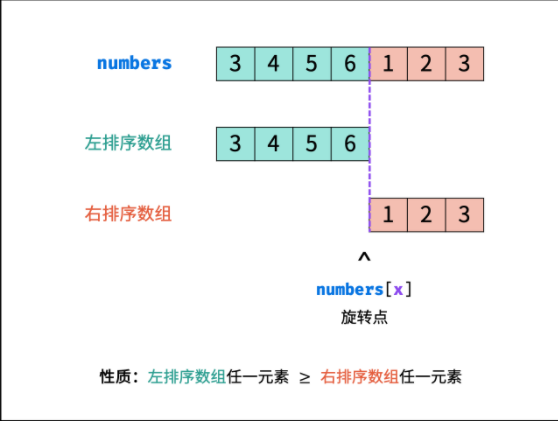

# 剑指offer 11. 旋转数组的最小数字


### 题目地址：[旋转数组的最小数字](https://leetcode-cn.com/problems/xuan-zhuan-shu-zu-de-zui-xiao-shu-zi-lcof/)


### 题目描述：

>把一个数组最开始的若干个元素搬到数组的末尾，我们称之为数组的旋转。输入一个递增排序的数组的一个旋转，输出旋转数组的最小元素。例如，数组 [3,4,5,1,2] 为 [1,2,3,4,5] 的一个旋转，该数组的最小值为1。 
>


### 解答方法：

1. 

```java
class Solution {
    public int minArray(int[] numbers) {
        int min = numbers[0];
        for(int i =  1; i < numbers.length; i++){
            if(min > numbers[i]){
                min = numbers[i];
            }
        }
        return min;
    }
}
//"一个递增排序的数组的一个旋转"没用上
```

>正确思路：二分查找
>
>
>
>- 时间复杂度：O(log2N)
>- 空间复杂度：O(1)
>
>1. 由题目可知，我们只要找到旋转点，这个点就是最小值
>2. 而用二分法查找可降低时间复杂度为对数级别
>3. 如果`numbers[mid] < numbers[right]`说明 mid 在右排序的区间内了，则right移动
>4. 若`numbers[mid] > numbers[right]`则说明mid还在左排序数组里，则left移动
>5. 若相等则，遍历查找
>
>```java
>class Solution {
>    public int minArray(int[] numbers) {
>        int left = 0, right = numbers.length - 1;
>        while(left <= right){
>            int mid = (left + right) / 2;
>            if(numbers[mid] < numbers[right]){
>                right = mid; 
>            }else if(numbers[mid] > numbers[right]){
>                left = mid + 1;
>            }else{
>                int temp = left;
>                for(int i = temp + 1; i < right; i++){
>                    if(numbers[i] < numbers[temp]){
>                        temp = i;
>                    }
>                }
>                return numbers[temp];
>            }
>        }
>        return numbers[left];
>    }
>}
>```
>
>