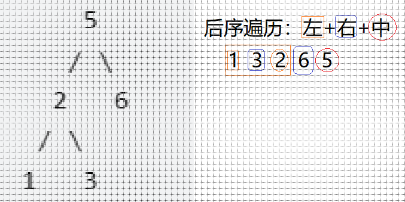

# 剑指offer 33. 二叉搜索树的后序遍历序列

### 题目地址：[二叉搜索树的后序遍历序列](https://leetcode-cn.com/problems/er-cha-sou-suo-shu-de-hou-xu-bian-li-xu-lie-lcof/)


### 题目描述：

>输入一个整数数组，判断该数组是不是某二叉搜索树的后序遍历结果。如果是则返回 `true`，否则返回 `false`。假设输入的数组的任意两个数字都互不相同。


### 解答方法：(



1. 递归

```java
class Solution {
    public boolean verifyPostorder(int[] postorder) {
        if(postorder.length < 2) return true;
        return verify(postorder, 0, postorder.length - 1);
    }

    public boolean verify(int[] postorder, int left, int right){
        if(left >= right) return true;
        int root = postorder[right];
        int r = right-1, l = left;

        while(postorder[r] > root && r > left){
            r--;
        }

        while(postorder[l] < root && l < right){
            l++;
        }
               //根节点只有一侧子树：l==r   
               //也可以：int temp = r;
               //        while{
              //                if()  }    
        return ((l == r)||(l == r+1)) && verify(postorder, left, r ) && verify(postorder, l, right - 1) ? true :false;
    }
}
```

> 思路二：单调栈

