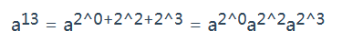

# 剑指offer 16. 数值的整数次方

### 题目地址：[数值的整数次方](https://leetcode-cn.com/problems/shu-zhi-de-zheng-shu-ci-fang-lcof/)


### 题目描述：

>实现 [pow(*x*, *n*)](https://www.cplusplus.com/reference/valarray/pow/) ，即计算 x 的 n 次幂函数（即，xn）。不得使用库函数，同时不需要考虑大数问题。


### 解答方法：

1. 超时

```java
class Solution {
    public double myPow(double x, int n) {
        double res = x;
        long tmp = n;
        if(tmp == 0 || x == 1)return 1;
        if(tmp > 0){
            for(int i = 1; i < tmp ; i++){
                res *= x;
            }
        }else{
            tmp = -tmp;
            x = 1/x;
            res = x;
            for(double i = 1; i < tmp ; i++){
                res *= x;
            }
        }
        return res;
    }
}
```

> 正确思路：快速幂，位运算
>
> 

```java
class Solution {
    public double myPow(double x, int n) {
        if(x == 0) return 0;
        if(n == 0) return 1;
        long l = n;
        double res = 1.0;
        if(l < 0){
            l = -l;
            x = 1 / x;
        }
        while(l != 0){
            if((l & 1) == 1){
                res *= x;
            }
            x *= x;
            l >>= 1; 
        }
        return res;
    }
}
```

