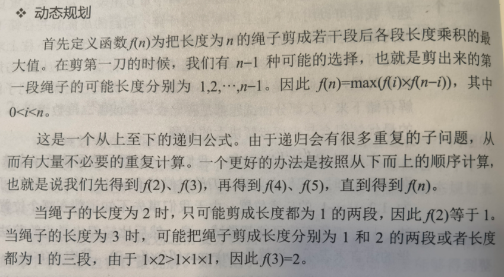

# 剑指offer 14 - I. 剪绳子


### 题目地址：[剪绳子](https://leetcode-cn.com/problems/jian-sheng-zi-lcof/)


### 题目描述：

给你一根长度为 n 的绳子，请把绳子剪成整数长度的 m 段（m、n都是整数，n>1并且m>1），每段绳子的长度记为 k[0],k[1]...k[m-1] 。请问 k[0]*k[1]*...*k[m-1] 可能的最大乘积是多少？例如，当绳子的长度是8时，我们把它剪成长度分别为2、3、3的三段，此时得到的最大乘积是18。


### 解答方法：

1. 动态规划



```java
class Solution {
    public int cuttingRope(int n) {
        if(n < 4) return n - 1;
        int[] dp = new int[n + 1];
        dp[2] = 1;
        for (int i = 3; i <= n; i++) {
            for (int j = 2; j < i; j++) {
                dp[i] = Math.max(dp[i],Math.max((i-j)*j, j*dp[i - j]));
            }

        }
        return dp[n];
    }
}
```


2. 贪心


3. 公式
