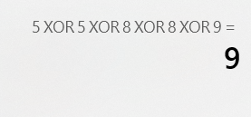

# 剑指offer 56 - I. 数组中数字出现的次数


### 题目地址：[数组中数字出现的次数](https://leetcode-cn.com/problems/shu-zu-zhong-shu-zi-chu-xian-de-ci-shu-lcof/)


### 题目描述：

一个整型数组 `nums` 里除两个数字之外，其他数字都出现了两次。请写程序找出这两个只出现一次的数字。要求时间复杂度是O(n)，空间复杂度是O(1)。


### 解答方法：

1. 

```java
//很乱的思路，先排序，然后前后没有相等的就为目标值
class Solution {
    public int[] singleNumbers(int[] nums) {
        if(nums.length == 0 || nums.length == 1)return nums;
        sort(nums);
        int temp = nums[0];
        int count = 0;
        int res[] = new int[2];
        for (int i = 0; i < nums.length; i += 2) {
            temp = nums[i];
            if(i == nums.length - 1){
                 res[count++] = nums[i];
                 break;
            }
            if(temp != nums[i + 1]){
                res[count++] = nums[i];
                i-=1;
            }else{
                continue; 
            }
        }
        return res;
    }
    public void sort(int[] nums){
        int inc, key, n = nums.length;
        for (inc = n/2; inc > 0; inc /= 2) {
            for (int i = inc; i < n; i++) {
                int j;
                key = nums[i];
                for (j = i; j >= inc && key < nums[j - inc]; j -= inc) {
                    nums[j] = nums[j - inc];
                }
                nums[j] = key;
            }
        }
    }
}
```


> 位运算



```java
//两个相等的数字，异或值为 0
//这样全部数字异或后得到的值为两个目标值的异或值
//根据异或的原理，二进制为 1 的值则为两个目标值不同的的二进制值
//通过这个 “1” 可见目标值分离开来
//在通过两个相同的数字异或为0，这一特d
class Solution {
    public int[] singleNumbers(int[] nums) {
        int a = 0, x1 = 0, x2 = 0, m = 1;
        for(int num : nums){
            a ^= num;
        }

        while((m & a) == 0){
            m <<= 1;
        }

        for(int num : nums){
            if((m & num) == 0){
                x1 ^= num;
            }else{
                x2 ^= num;
            }
        }

        return new int[]{x1, x2};
    }
}
```

