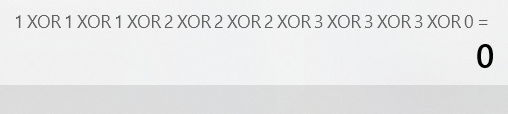
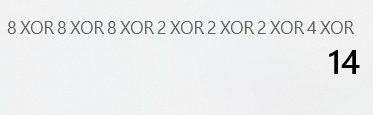

# 剑指offer 56 - II. 数组中数字出现的次数 II


### 题目地址：[数组中数字出现的次数 II](https://leetcode-cn.com/problems/shu-zu-zhong-shu-zi-chu-xian-de-ci-shu-ii-lcof/)


### 题目描述：

在一个数组 `nums` 中除一个数字只出现一次之外，其他数字都出现了三次。请找出那个只出现一次的数字。


### 解答方法：

1. 

```java
//hashMap.containsKey()
class Solution {
    public int singleNumber(int[] nums) {
        HashMap<Integer,Boolean> hashMap = new HashMap<>();
        for(int num : nums){
            if(!hashMap.containsKey(num)){
                hashMap.put(num,true);
            }else{
                hashMap.put(num, false);
            }
        }
        int res = 0;
        for (int i = 0; i < nums.length; i++) {
            if(hashMap.get(nums[i])){
                res = nums[i];
                break;
            }
        }
        return res;
    }
}
```


2. 位运算

    

    

