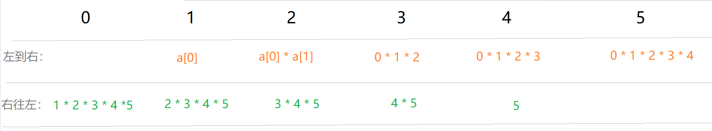

# 剑指offer 66. 构建乘积数组


### 题目地址：[构建乘积数组](https://leetcode-cn.com/problems/gou-jian-cheng-ji-shu-zu-lcof/)


### 题目描述：

给定一个数组 A[0,1,…,n-1]，请构建一个数组 B[0,1,…,n-1]，其中 B[i] 的值是数组 A 中除了下标 i 以外的元素的积, 即 B[i]=A[0]×A[1]×…×A[i-1]×A[i+1]×…×A[n-1]。不能使用除法。


### 解答方法：



1. 

```java
//注："tmp *= a[i],i++" 不可以写成 "i++, tmp *= a[i]"
//     执行顺序不同，会越界
class Solution {
    public int[] constructArr(int[] a) {

        int[] b = new int[a.length];

        for (int i = 0, tmp = 1; i < a.length; tmp *= a[i],i++) {
            b[i] = tmp;
        }

        for (int i = a.length - 1, tmp = 1; i >= 0; tmp *= a[i], i--) {
            b[i] *= tmp;
        }
        return b;

    }
}
```

