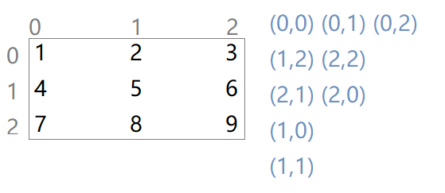
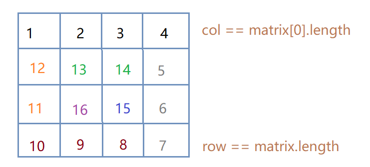

# 剑指offer 29. 顺时针打印矩阵


### 题目地址：[顺时针打印矩阵](https://leetcode-cn.com/problems/shun-shi-zhen-da-yin-ju-zhen-lcof/)


### 题目描述：

输入一个矩阵，按照从外向里以顺时针的顺序依次打印出每一个数字。


### 解答方法：





1. 

```java
class Solution {
    public int[] spiralOrder(int[][] matrix) {
        if(matrix.length == 0) return new int[0];
        int row = 0, col = 0;
        int[] res = new int[matrix.length * matrix[0].length];
        int count = 0;

        while(count != matrix.length * matrix[0].length){

            while(col < matrix[0].length && matrix[row][col] != Integer.MIN_VALUE){
                res[count++] = matrix[row][col];
                matrix[row][col] = Integer.MIN_VALUE;
                col++;
            }
            col--;
            row++;
            while(row < matrix.length && matrix[row][col] != Integer.MIN_VALUE){
                res[count++] = matrix[row][col];
                matrix[row][col] = Integer.MIN_VALUE;
                row++;
            }
            col--;
            row--;
            while(col >= 0 && matrix[row][col] != Integer.MIN_VALUE){
                res[count++] = matrix[row][col];
                matrix[row][col] = Integer.MIN_VALUE;
                col--;
            }
            row--;
            col++;
            while(row >= 0 && matrix[row][col] != Integer.MIN_VALUE){
                res[count++] = matrix[row][col];
                matrix[row][col] = Integer.MIN_VALUE;
                row--;
            }
            col++;
            row++;
        }
        return res;

    }
}
```

