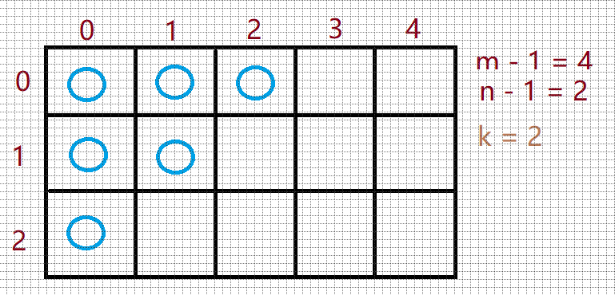
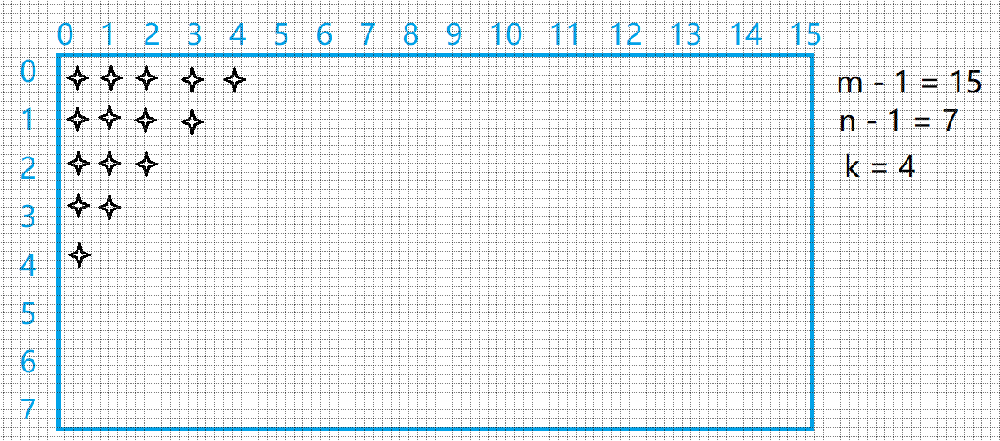

# 剑指offer 13. 机器人的运动范围

### 题目地址：[机器人的运动范围](https://leetcode-cn.com/problems/ji-qi-ren-de-yun-dong-fan-wei-lcof/)


### 题目描述：

>地上有一个m行n列的方格，从坐标 [0,0] 到坐标 [m-1,n-1] 。一个机器人从坐标 [0, 0] 的格子开始移动，它每次可以向左、右、上、下移动一格（不能移动到方格外），也不能进入行坐标和列坐标的数位之和大于k的格子。例如，当k为18时，机器人能够进入方格 [35, 37] ，因为3+5+3+7=18。但它不能进入方格 [35, 38]，因为3+5+3+8=19。请问该机器人能够到达多少个格子？
>


### 解答方法：






1. 错误代码

```java
class Solution {
    public int movingCount(int m, int n, int k) {
        int sum = 0;
        int row = m - 1 < k ? m - 1 : k;
        int col = n - 1 < k ? n - 1 : k;
        for(int i = 0; i <= row; i++){
            for(int j = 0; j <= col; j++){
                if(i % 10 + i /10 + j % 10 + j / 10 <= k) sum++;
            }
        }
        return sum;
    }
}
```

> 正确思路
>
> 

1. 深度优先遍历 DFS

```java
class Solution {
    public  int movingCount(int m, int n, int k) {
        boolean[][] visit = new boolean[m][n];
        return dfs(visit,0,0,k,0,0);
    }
    public int dfs(boolean[][] visit,int row,int col,int k,int row1,int col1){
        if(row > visit.length-1 || col > visit[0].length-1 || k < row1 + col1 || visit[row][col]) return 0;
        visit[row][col] = true;
       return 1 + dfs(visit,row+1,col,k,(row+1)%10+(row+1)/10,(col)%10+(col)/10) + dfs(visit,row,col+1,k,(row)%10+(row)/10,(col+1)%10+(col+1)/10);
    }
}
```

> 更简洁：
>
> - 成员变量 ： int m, n, k;     boolean[][] visited;
> - row1 = (row + 1) % 10 != 0 ? row + 1 : row- 8


2. 广度优先遍历 BFS

   ```java
   class Solution {
       public int movingCount(int m, int n, int k) {
           Queue<int[]> queue = new LinkedList<>();
           int res = 0;
           boolean[][] visit = new boolean[m][n];
           queue.add(new int[]{0,0,0,0});
           while (!queue.isEmpty()){
               int[] x = queue.poll();
               int row = x[0],col = x[1], row1 = x[2], col1 = x[3];
               if(row >= m || col >= n || k < row1 + col1 || visit[row][col]) continue;
               res++;
               visit[row][col] = true;
               queue.add(new int[]{row+1,col,(row+1)%10+(row+1)/10,(col)%10+(col)/10});
               queue.add(new int[]{row,col+1,(row)%10+(row)/10,(col+1)%10+(col+1)/10});
           }
           return res;
       }
   }
   ```

   